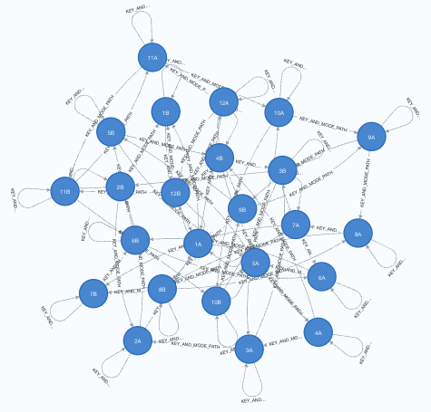
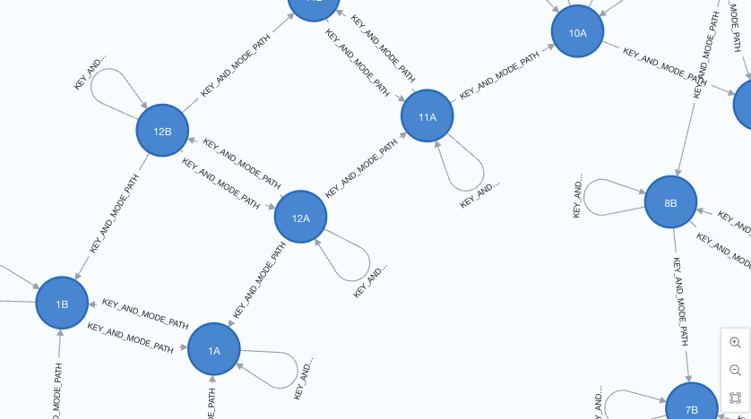

# Neo4j and the Musical Circle of Fifths

The notebook "circle_of_5ths.ipynb" generates the circle of fifths from western music theory and loads it into Neo4j so that key changes prove harmonious if the key change moves in direction of the relationship pathways.

